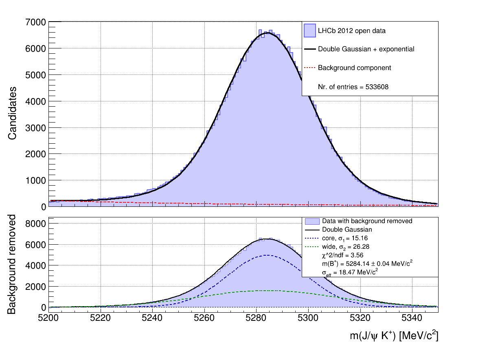

# B⁺ → J/ψ K⁺ with LHCb 2012 open data

Reconstruction of the decay B⁺ → J/ψ(→ μ⁺μ⁻) K⁺ from publicly released LHCb
Run 1 collision data, from raw stripped DSTs through to a fitted mass peak.

Second-year undergraduate summer project. Everything here runs on a laptop:
the data is streamed from CERN over XRootD rather than downloaded, so the only
large file produced locally is the ntuple.



## Main result: an uncalibrated momentum scale

Both reconstructed masses come out consistently **above** their PDG values, by
about one part in a thousand:

| Peak | Measured | PDG | Offset | Fractional |
| --- | --- | --- | --- | --- |
| m(B⁺), unconstrained | 5284.03 ± 0.03 MeV/c² | 5279.34 | +4.69 MeV/c² | +8.9 × 10⁻⁴ |
| m(J/ψ), unconstrained | 3100.24 ± 0.01 MeV/c² | 3096.90 | +3.34 MeV/c² | +10.8 × 10⁻⁴ |
| m(B⁺), J/ψ mass constrained (DTF) | 5280.81 ± 0.03 MeV/c² | 5279.34 | +1.47 MeV/c² | +2.8 × 10⁻⁴ |

Two independent peaks, built from different final states, give the same
fractional shift in the same direction. That points at the momentum scale
rather than at either decay: the open data release is not calibrated for it,
so every reconstructed momentum is slightly too large and every invariant mass
follows.

The J/ψ offset is the larger of the two in fractional terms, which is what one
would expect. Its mass comes almost entirely from the muon momenta, whereas
m(B⁺) picks up a contribution from the kaon's rest mass, which no momentum
scale error can touch.

Both magnet polarities show the effect. The 2012 data was taken with the
dipole field in both directions, and the samples are processed and fitted
independently:

| Polarity | m(J/ψ) | Offset | Fractional |
| --- | --- | --- | --- |
| MagUp | 3100.24 ± 0.01 MeV/c² | +3.34 MeV/c² | +10.8 × 10⁻⁴ |
| MagDown | 3099.13 ± 0.06 MeV/c² | +2.23 MeV/c² | +7.2 × 10⁻⁴ |

Same sign, same order of magnitude, from data taken with opposite field
directions — so the shift is not an artefact of one dataset. The two are not
identical, however: MagUp sits about 1.1 MeV/c² higher than MagDown. A
residual polarity dependence on top of the overall scale is expected, since
reversing the field reverses the direction in which any detector misalignment
displaces a track, and the two do not cancel exactly. Quoting the average of
the polarities is the usual way to suppress it. See
`Jpsi_double_gaussian_magdown.png`.

**DecayTreeFitter removes most of it.** Constraining the dimuon mass to the
known J/ψ mass forces the muon momenta onto the right scale, so only the
kaon's share of the bias survives — and +1.47 MeV/c² is close to a third of
+4.69, which is roughly the kaon's share of the sensitivity. See
`Bplus_dg_dtf.png` against `Bplus_double_gaussian_magup.png` for the
before-and-after, and `Jpsi_dg_cuts.png` for the dimuon peak that motivates
the interpretation.

### A mass window is not a substitute

An early version of the selection required the measured dimuon mass to lie
within 10 MeV/c² of the **PDG** J/ψ mass. Because the observed J/ψ peak sits
2.5 MeV/c² higher than that, the window was offset relative to the data and
preferentially kept candidates whose muon momenta had fluctuated downward.
The fitted m(B⁺) duly dropped to 5281.90 — closer to the PDG value, and wrong.

Recentring the same window on the **observed** peak restored 5284.03 with the
width essentially unchanged (12.29 → 12.33 MeV/c²), confirming that the shift
was selection bias rather than a real improvement.

The general point: a cut can only discard candidates, never correct the ones
it keeps. DecayTreeFitter refits each candidate instead, which is why it can
remove a bias that no selection can.

## Fit results

All fits use a double Gaussian sharing a mean, plus an exponential background.
Selection: `Kplus_PIDK > 2`, `Bplus_DIRA_OWNPV > 0.9999`,
`Bplus_FDCHI2_OWNPV > 100`, `Bplus_IPCHI2_OWNPV < 25`,
`Bplus_ENDVERTEX_CHI2 < 20`.

| Fit | Entries | Mass (MeV/c²) | σ_eff (MeV/c²) | χ²/ndf |
| --- | --- | --- | --- | --- |
| B⁺, loose cuts | 533 608 | 5284.14 ± 0.04 | 18.47 | 3.56 |
| B⁺, full cuts | 365 237 | 5284.03 ± 0.03 | 12.33 | 1.21 |
| B⁺, full cuts + DTF | 156 290 | 5280.81 ± 0.03 | 9.72 | 1.33 |
| J/ψ, MagUp | 994739 | 3100.10 ± 0.02 | 14.19 | 7.94 |
| J/ψ, MagDown | 55 664 | 3099.13 ± 0.06 | 13.54 | 1.47 |

The DTF row covers fewer candidates only because I parsed through fewer .dst files 
for that ntuple; it is not a selection effect.

A single Gaussian gives a clearly worse χ²/ndf than the double Gaussian on the
same data, which is the justification for the extra two parameters. The
residual χ²/ndf above 1 is dominated by the radiative tail: final-state
radiation and J/ψ → μ⁺μ⁻γ remove energy, so the true peak is asymmetric on the
low side while two Gaussians sharing a mean are symmetric by construction.
This is most visible in the MagUp J/ψ fit, where the statistics are largest:
the MagDown fit of the same shape reaches χ²/ndf 1.47 on a sample 28 times
smaller, not because the model fits better but because the statistical errors
are large enough to hide the mismatch. A
Crystal Ball function would be the standard remedy; the masses quoted above
may shift by a few tenths of an MeV/c² once that is done.

## Data

CERN Open Data Portal, LHCb 2012, Stripping21r0p2, DIMUON stream:

| Record | Polarity | Files |
| --- | --- | --- |
| [28070](https://opendata.cern.ch/record/28070) | MagUp | 4390 |
| [28064](https://opendata.cern.ch/record/28064) | MagDown | 4591 |

Candidates come from the stripping line `Bs2MuMuLinesBu2JPsiKFullDSTLine`.
Both polarities have been processed; each is tupled separately and kept in its
own output directory, since mixing them would average away the polarity
dependence described above.

## Requirements

- LHCb software from CVMFS, accessed with `lb-run DaVinci/v45r8`
- Linux, or WSL2 on Windows (developed on AlmaLinux 9 under WSL2)
- No local copy of the data: the DSTs are read over XRootD

Setting up CVMFS is the hardest part of getting started. One should ask their supervisor for a guide if possible.

## Running the analysis

Build the list of input files (writes `filelist.txt`):

```bash
python make_filelist.py 28070
mv filelist.txt filelist_magup.txt
```

Produce the ntuples. This is the long step — a few days of wall time for the
full sample on four cores. It is resumable: each finished chunk leaves a
`.done` marker, so an interrupted run picks up where it stopped.

```bash
python run_parallel_all.py --workers 4 --max-files 10   # short smoke test first
python run_parallel_all.py --workers 4                  # the real run
python run_parallel_all.py --merge-only                 # just re-merge what exists
```

The DecayTreeFitter ntuple is produced separately, by the same driver pointed
at a different options file and its own output directory:

```bash
python run_parallel_dtf.py --workers 4
```

Fit and plot:

```bash
lb-run DaVinci/v45r8 python plot_single_gaussian.py DVntuple_jpsi_all.root
lb-run DaVinci/v45r8 python plot_double_gaussian.py DVntuple_jpsi_all.root
lb-run DaVinci/v45r8 python plot_jpsi_double_gaussian.py DVntuple_jpsi_all.root
lb-run DaVinci/v45r8 python plot_bplus_dg_dtf.py DVntuple_jpsidtf_all.root
```

The plotting scripts print a `localhost` link to the figure they just saved,
served by `serve_plots.py`. Start the server once per session first:

```bash
nohup python3 serve_plots.py ~/data 8000 > ~/serve_plots.log 2>&1 &
```

Delete the `from show import show` and `show(...)` lines from a plotting
script if you would rather it just wrote the PNG and said nothing.

## What each script does

| File | Purpose |
| --- | --- |
| `make_filelist.py` | Fetches the XRootD URLs for an open data record |
| `ntuple_jpsi_all.py` | DaVinci options file: DSTs in, flat ntuple out |
| `ntuple_jpsidtf_all.py` | The same, with DecayTreeFitter added |
| `run_parallel_all.py` | Runs several DaVinci jobs at once, then merges |
| `run_parallel_dtf.py` | The same driver, pointed at the DTF options file |
| `plot_single_gaussian.py` | Gaussian + exponential fit to the B⁺ peak |
| `plot_double_gaussian.py` | Narrow core + wide component, for the resolution mixture |
| `plot_jpsi_double_gaussian.py` | The same fit applied to the dimuon peak |
| `plot_bplus_dg_dtf.py` | Double Gaussian fit to the DTF-refitted B⁺ mass |
| `show.py`, `serve_plots.py` | View plots in a browser without copying files out of WSL |

`run_parallel_dtf.py` is `run_parallel_all.py` with five configuration
constants changed. Kept as a separate file deliberately, so that a run in
progress cannot be redirected by editing the other one.

The options files are never run directly. The drivers pass them to
`gaudirun.py` once per chunk, handing over the file range in environment
variables.

## Adapting this to a different decay

Change `stream` and `line` in `ntuple_jpsi_all.py` to your stripping line, and
`dtt.Decay` to its decay descriptor. Then in `run_parallel_all.py` update
`FILELIST`, `OPTIONS`, `OUTDIR`, `LOGDIR` and `MERGED`, plus the per-chunk
filename inside `run_one` and the matching marker pattern in `main`.

Three things that bite:

- Give a new tupling its own `OUTDIR`. The `.done` markers are keyed by index
  into the file list, not by filename, so stale markers make chunks look
  finished that were never run — and `merge()` globs `*.root` from that
  directory, so two tuplings sharing one would be silently merged together.
- Branch prefixes follow the decay descriptor, not reality. The hadron's
  branches are `Kplus_*` whether or not the track is a kaon, which is why
  `Kplus_PIDK` is worth cutting on.
- The DecayTreeFitter outputs are arrays indexed by primary vertex candidate,
  so the plotting scripts read `Bplus_ConsJpsi_M[0]` with the cut
  `Bplus_ConsJpsi_status[0]==0`. Index 0 is the best PV.

If the line writes to microDST rather than full DST, set
`DaVinci().RootInTES` and give `dtt.Inputs` the relative path instead.

## Notes

Ntuples, logs and per-chunk outputs are not tracked — see `.gitignore`. Rerun
the pipeline to regenerate them.

## License

Code in this repository is released under the MIT License (see `LICENSE`).
The underlying LHCb data belongs to CERN and is distributed under the terms
given on the open data record pages.
